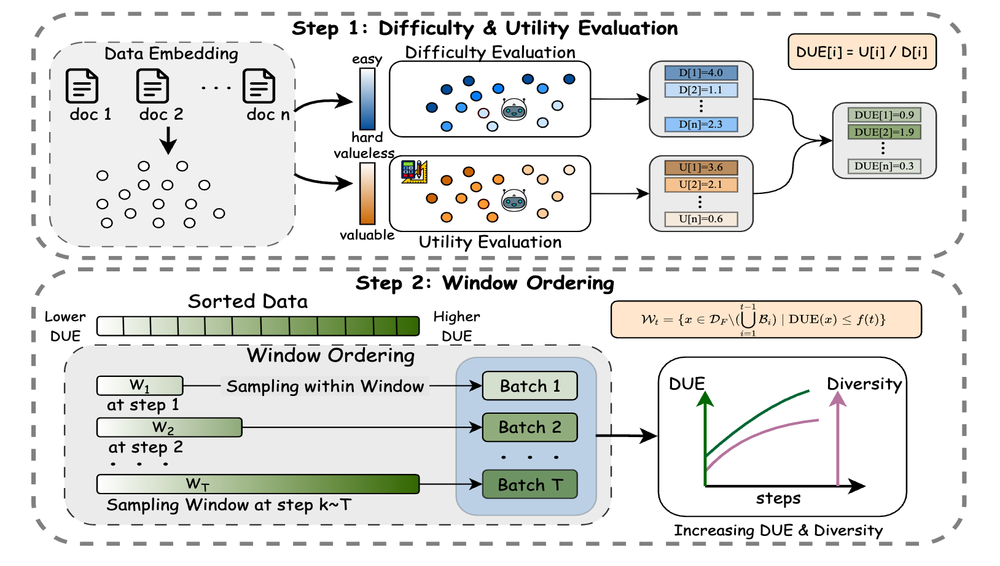
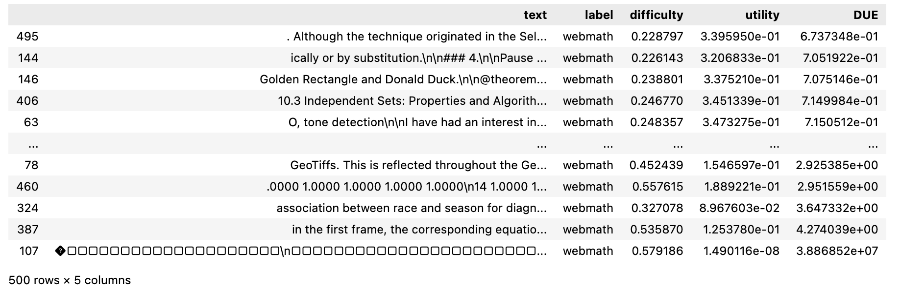
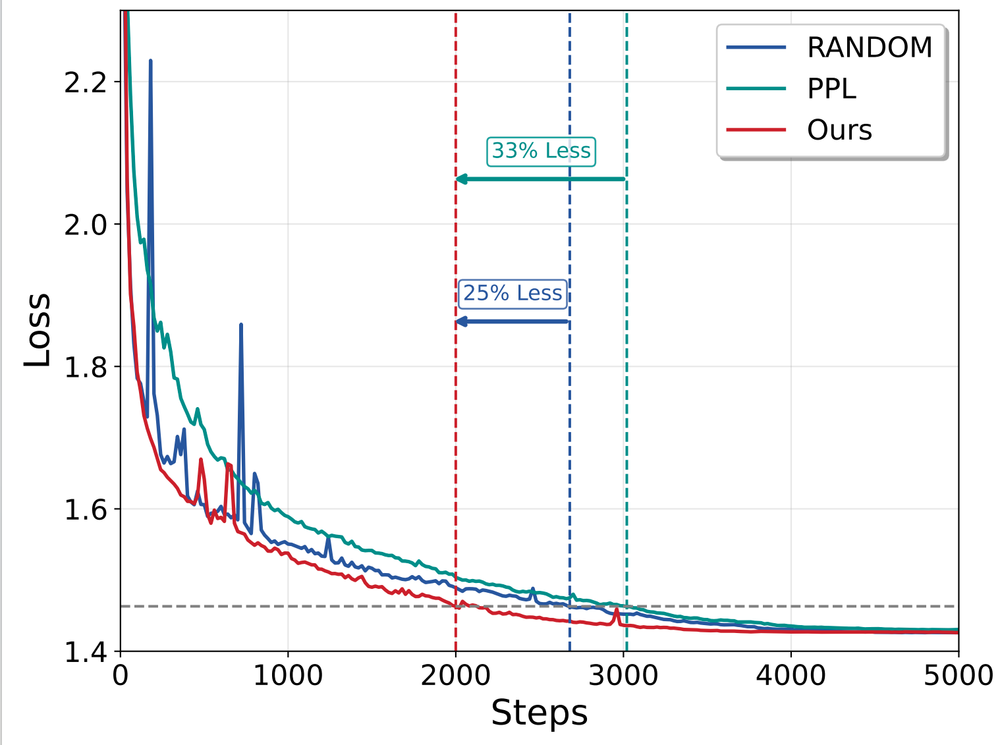
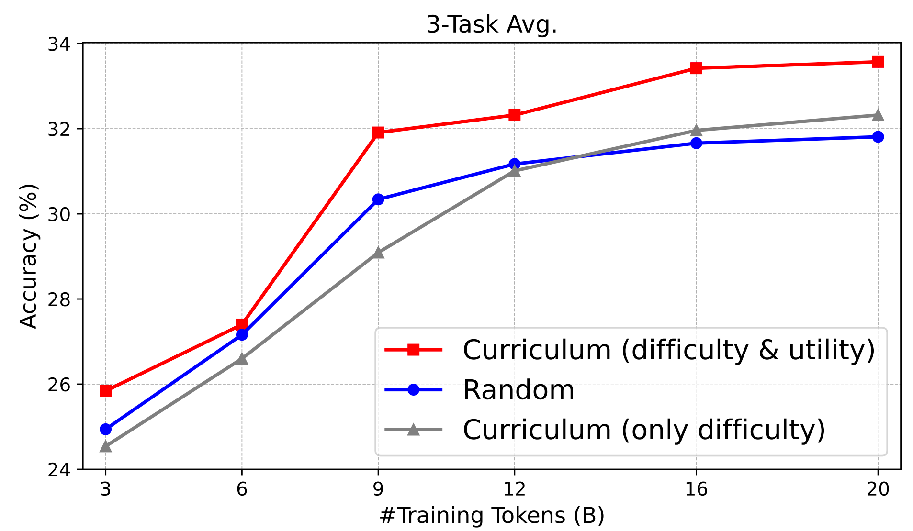

<h1 align="center">Difficulty Is Not Enough: Curriculum Learning for LLMs Fine-tuning Must Consider Utility</h1>
<div align="center"> 

[]()
[]() 

</div>

# Introduction
This repository provides the official implementation of Difficulty-Utility Curriculum Learning (DUCL), a novel curriculum learning framework designed to improve the efficiency and effectiveness of fine-tuning large language models (LLMs). Unlike conventional curricula that rely solely on sample difficulty, DUCL jointly considers both difficulty and utility—the contribution of each sample to model performance—through a data-driven evaluation method called Difficulty-Utility Evaluation (DUE). Combined with a soft scheduling strategy, Window Ordering, DUCL accelerates convergence, stabilizes training, and achieves superior final performance with negligible computational overhead. 



# 🚀 Quick Start
## 📦 Environment
The runtime environment is in the requirements.txt so you can

```bash
pip install -r requirements.txt
```

## Data Preparation
Prepare your corpus as a .jsonl file, where each line is a JSON object with the field "text" containing the sample content.
For example:

```json
{"text": "Sample sentence 1."}
{"text": "Sample sentence 2."}
```
We provide a reference example in the `data/` directory.


## Difficulty-Utility Evaluation (DUE)
Compute sample embeddings and evaluate DUE scores:
```bash
python main.py 
    --data <train_data> 
    --initial_data <initial_distribution_data> 
    --source_val <source_validation_data> 
    --target_val <target_validation_data> 
    --cache_path <cache_directory> 
    --result_path <output_due_scores>
    --encoder_path <embedding_model_path>
```

**Arguments**

- `--data`
Path to the target dataset (JSONL format) that you want to evaluate and construct the curriculum for.

- `--initial_data`
Path to the dataset representing the initial distribution (e.g., pre-training corpus sample).

- `--source_val`
Path to the source domain validation set used in DUE calculation.

- `--target_val` *(optional)*
Path to the target domain validation set. If not provided, cross-validation on `source_val` will be used by default.
- `--cache_path`
Directory where intermediate embedding files will be cached to avoid recomputation.
- `--result_path`
Path to save the computed DUE scores (in JSONL format).
- `--encoder_path`
Path to your embedding model, defaulting to sentence-transformers/all-MiniLM-L12-v2 if not specified.


## Example
We provide a small test dataset sampled from Fineweb-Edu and Proof-Pile-2 (500 samples each) to help you quickly try out DUCL.

You can start the entire pipeline by simply running:
```bash
bash run_example.sh
```
After execution, the results (including computed DUE scores and generated curriculum) will be saved in the `results/` directory.

✅ **Example Output**

You can also use the provided Jupyter notebook to quickly view the result `scripts/data_reader.ipynb`


## 📈 Evaluation
DUCL is compared with Randomshuffle and Difficulty-only Curriculum.  The results demonstrate **faster convergence** and **superior final accuracy**.

| Training Dynamics | Downstream Accuracy |
|-------------------|---------------------|
|  |  |
