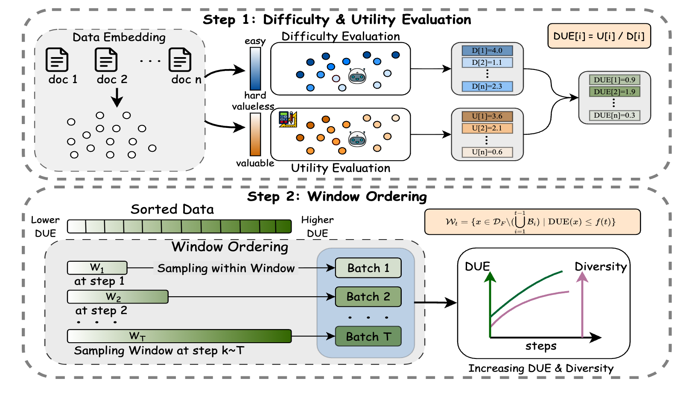
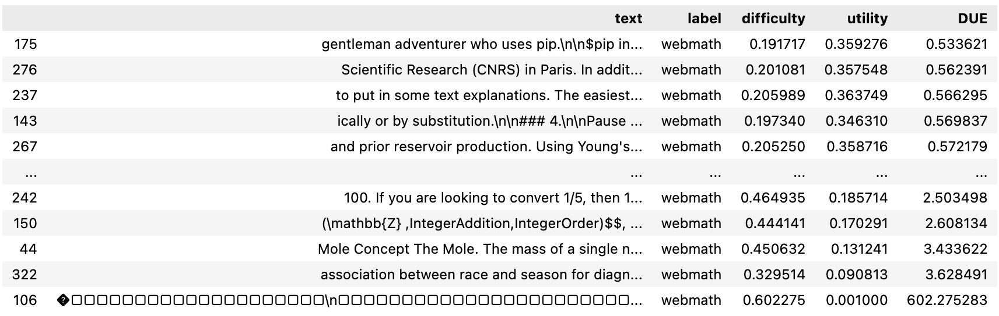

<h1 align="center">Difficulty Is Not Enough: Curriculum Learning for LLMs Fine-tuning Must Consider Utility</h1>
<div align="center"> 

</div>

# Introduction
This repository provides the official implementation of Difficulty-Utility Curriculum Learning (DUCL), a novel curriculum learning framework designed to improve the efficiency and effectiveness of fine-tuning large language models (LLMs). Unlike conventional curricula that rely solely on sample difficulty, DUCL jointly considers both difficulty and utility—the contribution of each sample to model performance—through a data-driven evaluation method called Difficulty-Utility Evaluation (DUE). Combined with a soft scheduling strategy, Window Ordering, DUCL accelerates convergence, stabilizes training, and achieves superior final performance with negligible computational overhead. 



# 🚀 Quick Start
## 📦 Environment
The runtime environment is in the requirements.txt so you can

```bash
pip install -r requirements.txt
```

## Data Preparation
Prepare your corpus as a .jsonl file, where each line is a JSON object with the field "text" containing the sample content.
For example:

```json
{"text": "Sample sentence 1."}
{"text": "Sample sentence 2."}
```

For QA-style data, each line can alternatively be formatted with explicit prompt–response fields, for example:

```json
{"prompt": "Sample 1 prompt.", "response": "Sample 1 response."}
```

We provide a reference example in the `data/` directory.


## Difficulty-Utility Evaluation (DUE)
Compute sample embeddings and evaluate DUE scores:
```bash
python main.py 
    --data <train_data> 
    --source_val <source_validation_data> 
    --target_val <target_validation_data> 
    --cache_path <cache_directory> 
    --result_path <output_due_scores>
    --encoder_path <embedding_model_path>
    --chunk_num <num> 
    --batch_size <num>
```

**Arguments**

- `--data`
Path to the target dataset (JSONL format) that you want to evaluate and construct the curriculum for.


- `--source_val`
Path to the source domain validation set used in DUE calculation.

- `--target_val`
Path to the target domain validation set. 
- `--cache_path`
Directory where intermediate embedding files will be cached to avoid recomputation.
- `--result_path`
Path to save the computed DUE scores (in JSONL format).
- `--encoder_path`
Path to your embedding model, defaulting to sentence-transformers/all-MiniLM-L12-v2 if not specified.
- `--chunk_num` 
Number of chunks to split each input text into when it exceeds the encoder context limit.
- `--batch_size` 
Batch size used for embedding computation.

## Data Ordering
We provide multiple data ordering strategies for curriculum training, including:
```bash
# Ascending Ordering
bash example/asc_ordering.sh
# Window Ordering(linear)
bash example/window_linear_ordering.sh
# Window Ordering(linear)
bash example/window_quantile_ordering.sh
# Fold Ordering
bash example/fold_ordering.sh
```
**Strategy overview:**

* **Ascending Ordering**:
  Sorts all samples by the DUE score in ascending order and trains from easy to hard.

* **Window Ordering (linear)**:
  Uses the window ordering strategy, where the scheduling function linearly interpolates within the sample DUE range across training steps.

* **Window Ordering (quantile)**:
  Uses the window ordering strategy with a scheduling function that increases the sampling window based on DUE quantiles across training steps.

* **Fold Ordering**:
  Repeats ascending ordering multiple times by interleaving samples at a fixed interval.

## Example
We provide a small test dataset sampled from Fineweb-Edu and Proof-Pile-2 to help you quickly try out DUCL.

You can start the entire pipeline by simply running:
```bash
bash example/run_example.sh
```
After execution, the results (including computed DUE scores and generated curriculum) will be saved in the `results/` directory.

✅ **Example Output**

You can also use the provided Jupyter notebook to quickly view the result `scripts/data_reader.ipynb`


